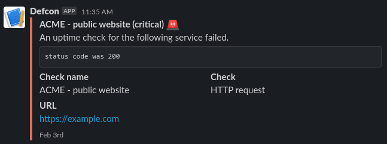

# Alerters

An alerter defined what is to be done when an outage is confirmed. Generally, information about the outage is be sent through HTTP to a configurable URL, with different schemas depending on the alerting service chosen.

As of now, only two alerters are supported: generic Webhook and Slack message.

## Wehook

```json
{
  "kind": "webhook",
  "webhook": "https://webhooks.example.com/b82225cf-7af2-494c-b570-7850546bf8a3"
}
```

When an outage is to be emitted to this kind of alerter, a payload is constructed containing all the information about the outage. It is the upstream alerting service's responsibility to handle our schema and act accordingly.

The payload that will be sent to the webhook is akin to this schema:

```json
{
  // Check definition
  ...,
  "level": "critical", // Or "warning", "ok"
  "spec": {
    // Handler definition
  },
  "outage": {
    // Outage definition
  }
}
```

## Slack

```json
{
  "kind": "slack",
  "webhook": "https://hooks.slack.com/services/XXXXXXX/YYYYYYY/123456"
}
```

The Slack alerter is a variation of the Webhook alerter that formats the payload transmitted to the upstream server to be properly displayed as a Slack message. Here is an example of output in a Slack channel.


